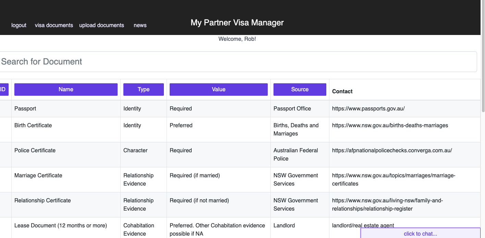

# My Partner Visa Manager

## Description
A react app that allows the user to view the list of documents required for an Australian partner visa, and provides guidance on the nature of the documents and where to locate them.

## Preview

## Badges

## Table of Contents
   * [Installation](#Installation)
   * [Usage](#Usage)
   * [License](#License)
   * [Contribution](#Contribution)
   * [Collaborators](#Collaborators)
   * [Questions](#Questions)

## Installation
The user can access the application via the GitHub Pages link here:

https://cnat3103.github.io/My-Partner-Visa

Alternatively, the user can fork the repository, install the necessary dependencies by running the npm i command via the user's command line, and run the app using the npm start command.

## Usage
The application is simple to use - we would encourage anyone experiencing difficulty to get in touch.

## License
MIT license

## Contribution
Number of online resources assisted in producing this.

## Collaborators
There are many ways in which you can participate in the project, for example:

- Submit bugs and feature requests, and help us verify as they are checked in
- Review source code changes
- Review the documentation and make pull requests for anything from typos to new content

## Questions
Email: christopher.j.natale@gmail.com.
Github Profile: http://github.com/cnat3103